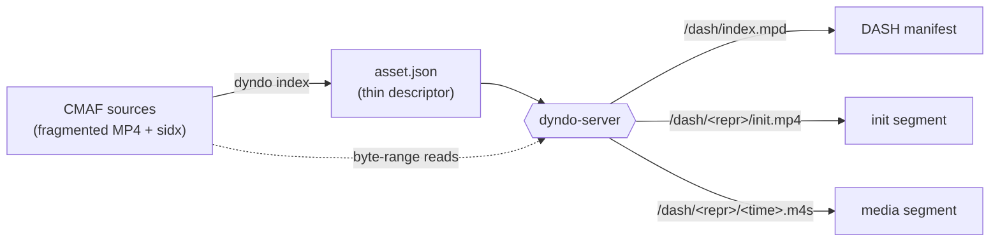

# dyndo

**Dynamic media packaging for adaptive streaming, in Rust.**


`dyndo` turns your existing CMAF files into an adaptive-streaming service **without
repackaging or duplicating a single byte of media**. You index your sources once
into a tiny JSON descriptor; the server then generates DASH manifests and serves
CMAF segments *on the fly*, straight from the original files via HTTP byte-range
reads.

> [!NOTE]
> `dyndo` is in early development (`0.1.0`). Both DASH and HLS are implemented,
> served from the same CMAF sources.

## Why dyndo

Traditional packagers transcode-and-write a full set of DASH/HLS renditions to
disk ahead of time, duplicating your media and coupling storage to a protocol.
`dyndo` takes the opposite approach — the **thin pointer**:

- **No duplicated storage.** `asset.json` records only per-track metadata and a
  source key. It contains no segment list, no byte offsets, no init range.
- **Bounded memory.** To serve an asset, `dyndo` reads just the header region of
  each source (`moov` + `sidx` + first `moof`, ~10 KB) and re-derives the entire
  segment index from the `sidx`. An 800 MB file is parsed exactly like an 8 MB
  one — the `mdat` body is never touched.
- **One source of truth.** The `sidx` *is* the segment map; `dyndo` never copies
  it. The same parser serves the CLI (to summarise and validate) and the server
  (to build the runtime index).
- **Protocol at the edge.** Media segments are the same CMAF for every protocol;
  only the manifest is protocol-specific, so `dyndo` speaks both DASH and HLS
  over one set of segment routes.

## How it works



1. **Index** your CMAF files once with the `dyndo` CLI to produce `asset.json`.
2. **Serve** that descriptor with `dyndo-server`. At request time it parses each
   source's header, derives the segment index, and answers manifest and segment
   requests with ranged reads from the original media.

## Project layout

`dyndo` is a Cargo workspace of three crates — one library and two binaries — with
a clean dependency direction: the core library carries no CLI or HTTP concerns and
is reused by both binaries.

| Crate | Kind | Responsibility |
|---|---|---|
| [`dyndo-core`](crates/dyndo-core) | library | CMAF header parsing (bounded memory via `mp4-atom`), the `Asset`/`Track` domain model, the `asset.json` serde contract, RFC 6381 codec strings, and DASH/HLS manifest generation (the `dash` and `hls` modules). Reads bytes through [OpenDAL](https://opendal.apache.org/). |
| [`dyndo-cli`](crates/dyndo-cli) | binary (`dyndo`) | The indexing and offline-manifest CLI. |
| [`dyndo-server`](crates/dyndo-server) | binary (`dyndo-server`) | The dynamic packaging HTTP server, built on [Axum](https://github.com/tokio-rs/axum). |

## Getting started

### Prerequisites

- A stable [Rust](https://www.rust-lang.org/tools/install) toolchain (edition 2021).
- Nightly `rustfmt` **only** if you plan to run `make fmt` (import grouping needs it).

### Build & install

```bash
# Release build of the CLI -> target/release/dyndo
make build

# Install the dyndo CLI into ~/.cargo/bin
make install

# Run the server (from the repo root)
make run
```

Prefer Cargo directly? `cargo build --release -p dyndo-cli` and
`cargo run -p dyndo-server` do the same.

## Usage

### 1. Index your sources

Build an `asset.json` descriptor from one or more CMAF files. Each `-i` is one
track; input paths are resolved relative to the output descriptor's directory.

```bash
dyndo index \
  -i index_video_avc_1080.mp4 \
  -i index_video_avc_720.mp4 \
  -i index_audio_aac_nl_2.mp4 \
  -o assets/asset.json
```

| Option | Description | Default |
|---|---|---|
| `-i, --input <PATH>` | Input CMAF file, repeatable (one track per file). | *(required)* |
| `-o, --output <PATH>` | Output descriptor path. | `asset.json` |

> [!IMPORTANT]
> Inputs must be valid CMAF: a fragmented MP4 with a `moov` containing exactly
> one track, a `sidx` segment index, and a supported codec. Any violation aborts
> the run — no silent fallbacks, no skip-and-continue.

The result is a small, human-readable descriptor:

```json
{
  "tracks": [
    {
      "type": "video",
      "id": "video_avc1_1080_4807228",
      "path": "index_video_avc_1080.mp4",
      "fourcc": "avc1",
      "timescale": 90000,
      "width": 1920,
      "height": 1080
    }
  ]
}
```

### 2. Serve it

```bash
make run
# dyndo-server listening on http://0.0.0.0:8080
```

The server reads descriptors from `./assets` and exposes each one as both a DASH
and an HLS stream. Point a player at the manifest URL for either protocol:

```
http://localhost:8080/asset.json/dash/index.mpd    # DASH
http://localhost:8080/asset.json/hls/index.m3u8     # HLS
```

Every stream lives under `/<asset>/<protocol>/<resource>`, where `<asset>` is the
descriptor path relative to the assets root and `<repr>` is a representation `id`
from the descriptor (e.g. `video_avc1_1080_4807228`):

| Method | Route | Description |
|---|---|---|
| `GET` | `/<asset>/dash/index.mpd` | The asset's DASH manifest (MPD). |
| `GET` | `/<asset>/hls/index.m3u8` | The asset's HLS multivariant playlist. |
| `GET` | `/<asset>/hls/<repr>.m3u8` | An HLS rendition's media playlist. |
| `GET` | `/<asset>/<protocol>/<repr>/init.mp4` | A representation's initialization segment. |
| `GET` | `/<asset>/<protocol>/<repr>/<time>.m4s` | The media segment starting at presentation `time`. |

The `init.mp4` and `<time>.m4s` segment routes are the same CMAF under either
`<protocol>` prefix — segments are shared, only the manifest differs.

CORS is open (any origin, any method), so a manifest can be loaded from a
browser-based player during development.

### Offline manifests (optional)

The CLI can also render a static MPD from a descriptor — handy for inspection or
debugging without running the server:

```bash
dyndo dash -i assets/asset.json -o assets/stream.mpd --compact
```

| Option | Description | Default |
|---|---|---|
| `-i, --input <PATH>` | Input `asset.json`. | `asset.json` |
| `-o, --output <PATH>` | Output manifest path. | `stream.mpd` |
| `-c, --compact` | Hoist `SegmentTemplate` content shared by all representations up to the `AdaptationSet` level. | off |

The same descriptor renders to HLS playlists in a directory (a multivariant
`index.m3u8` plus one `<repr>.m3u8` per track):

```bash
dyndo hls -i assets/asset.json -o assets/hls
```

| Option | Description | Default |
|---|---|---|
| `-i, --input <PATH>` | Input `asset.json`. | `asset.json` |
| `-o, --output <DIR>` | Output directory for the playlists. | `hls` |

## Supported codecs

Codec parameters are read from the source and emitted as RFC 6381 strings.

| Media | Codec | Sample entry |
|---|---|---|
| Video | AVC / H.264 | `avc1` |
| Video | AV1 | `av01` |
| Audio | AAC | `mp4a` |
| Audio | Dolby Digital (AC-3) | `ac-3` |
| Audio | Dolby Digital Plus (E-AC-3) | `ec-3` |

## Storage backends

All I/O goes through [OpenDAL](https://opendal.apache.org/), so the source of
your media is pluggable. The local filesystem is enabled today; object stores
(S3, GCS, …) are an OpenDAL feature flag and a small amount of wiring away.

| Component | Root | Override |
|---|---|---|
| `dyndo` CLI | current directory | `OPENDAL_FS_ROOT` environment variable |
| `dyndo-server` | `./assets` | — (compile-time constant) |

## Development

Common tasks are wrapped in the [`Makefile`](Makefile):

| Target | Description |
|---|---|
| `make build` | Release build of the CLI. |
| `make build-debug` | Debug build of the CLI. |
| `make run` | Run `dyndo-server`. |
| `make test` | Run the whole workspace test suite. |
| `make lint` | Clippy across all targets, warnings as errors. |
| `make fmt` | Format all crates (nightly `rustfmt`). |
| `make fmt-check` | Verify formatting without modifying. |
| `make check` | Fast type-check of the workspace. |
| `make clean` | Remove build artifacts. |

Tests run against small, committed header-only CMAF fixtures under
[`tests/fixtures`](tests/fixtures) — just enough of each file (`ftyp` + `moov` +
`sidx` + first `moof`) to exercise parsing end to end without shipping gigabytes
of media.

## Releasing

Releases are cut locally and published by CI:

```bash
./scripts/release.sh          # prompts for the next version, e.g. 0.2.0
```

The script bumps all three crate versions in lockstep, commits
`release: <version>`, tags `v<version>`, and pushes. Pushing the tag triggers
[`.github/workflows/release.yml`](.github/workflows/release.yml), which verifies
the tag matches `Cargo.toml`, re-runs the CI gate, builds `dyndo` and
`dyndo-server` for Linux and macOS, and publishes a GitHub Release with the
binaries and a `SHA256SUMS` file.
